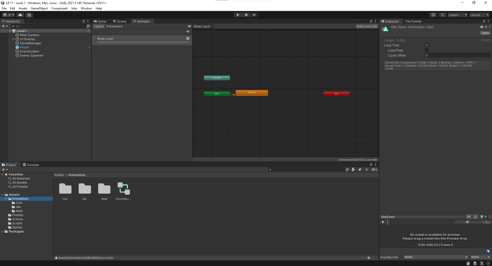

  Выполнил: Балахонцев И.О.
  

 Группа: ЭВТ-70
  

 Игровой движок: Unity 2021.3.9f1
  

 Название работы: разработка механики 2D рогалика
  

  

Рисунок 33.1 - Перекидываем спрайты в папку Sprites 

  

Рисунок 33.2 - Создаем папку Prefabs и делаем в ней префабы

  

Рисунок 33.3 - Создаем коды для множества объектов

  

Рисунок 33.4 - Создаем анимации для игрока, монет и т.д

  

Рисунок 33.5 - Сцена игрового поля

