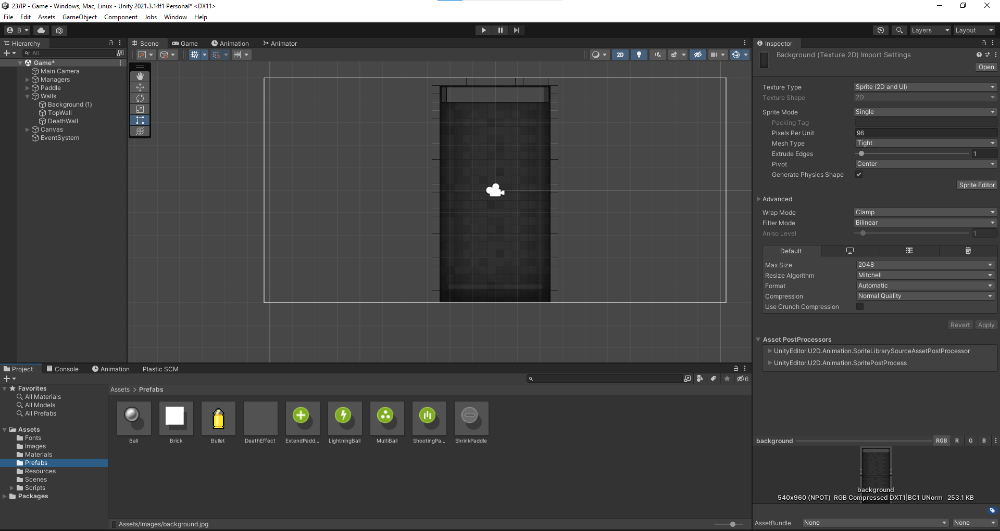

  Выполнил: Балахонцев И.О.
  

 Группа: ЭВТ-70
  

 Игровой движок: Unity 2021.3.14f1
  

 Название работы: разработать игровой проект Arkanoid
  

  

Рисунок 25.1 - Перекидываем спрайты данные спрайты

  

Рисунок 25.2 - Создаем папку Prefabs и создаем префабы шара и улучшений   

  

Рисунок 25.3 - Пишим скрипты для игровых объектов

  

Рисунок 25.4 - Сцена игрового проекта 

