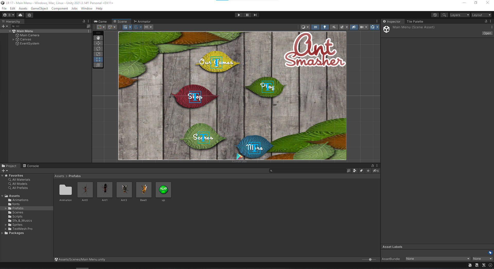

  Выполнил: Балахонцев И.О
  

 Группа: ЭВТ-70
  

 Игровой движок: Unity 2021.3.9f1
  

 Название работы: разработка игры Ant Smasher
  

  

Рисунок 28.1 - Перкидываем спрайты и настраиваем их 

  

Рисунок 28.2 - Создаем множество анимаций для игровых объектов 

  

Рисунок 28.3 - Создаем сцену игрового меню

  

Рисунок 28.4 - Создаем сцену геймплея 

  

Рисунок 28.5 - Геймплей игры

